# **1\. ชื่อโครงงาน**

ภาษาไทย: ระบบซื้อขายเครื่องประดับแฟชั่นออนไลน์ วิบวับ

ภาษาอังกฤษ: Wibwab – Online Fashion Jewelry E-Commerce System

# **2\. ผู้จัดทำ**

67153060 นายฐนิก ทรัพย์โนนหวาย

67130909 สราศินีย์ บุญมา

# **3\. บทนำ**

ปัจจุบันการซื้อขายสินค้าแฟชั่นผ่านช่องทางออนไลน์ได้รับความนิยมอย่างสูง โดยเฉพาะเครื่องประดับแฟชั่น เช่น แหวน สร้อยคอ ต่างหู และกำไล ซึ่งเป็นสินค้าที่ผู้บริโภคนิยมซื้อทั้งเพื่อใช้เองและเพื่อเป็นของขวัญ อย่างไรก็ตาม ร้านค้าเครื่องประดับขนาดเล็กจำนวนมากยังคงบริหารงานผ่านการจดบันทึกด้วยมือหรือผ่านช่องทางแชท ทำให้เกิดปัญหาในการจัดการคำสั่งซื้อ การตรวจสอบสต็อกสินค้าที่มีหลายไซซ์หลายสี และการสรุปยอดขาย ซึ่งใช้เวลามากและเกิดข้อผิดพลาดได้ง่าย

โครงงานนี้จึงนำเสนอการพัฒนาเว็บแอปพลิเคชันระบบซื้อขายเครื่องประดับแฟชั่นออนไลน์ ที่รองรับผู้ใช้งาน 3 กลุ่ม ได้แก่ ลูกค้า พนักงาน และแอดมิน โดยครอบคลุมกระบวนการตั้งแต่การเลือกซื้อสินค้า การชำระเงิน การจัดการคำสั่งซื้อและสต็อกสินค้า ไปจนถึงการออกรายงานสรุปสำหรับผู้บริหาร เพื่อเพิ่มประสิทธิภาพการดำเนินงานของร้านค้าและยกระดับประสบการณ์การซื้อสินค้าของลูกค้า

# **4\. วัตถุประสงค์**

1.  เพื่อพัฒนาเว็บแอปพลิเคชันซื้อขายเครื่องประดับแฟชั่นออนไลน์ที่รองรับผู้ใช้งาน 3 บทบาท ได้แก่ ลูกค้า พนักงาน และแอดมิน
2.  เพื่อออกแบบระบบจัดการสินค้าที่รองรับตัวเลือกสินค้า (Variant) หลายไซซ์ หลายสี และหลายวัสดุ
3.  เพื่อลดข้อผิดพลาดและระยะเวลาในการจัดการคำสั่งซื้อและสต็อกสินค้าของร้านค้า
4.  เพื่อให้แอดมินสามารถดูรายงานยอดขาย สต็อกสินค้า และผลประกอบการได้อย่างสะดวกและเป็นปัจจุบัน
5.  เพื่อประยุกต์ใช้ความรู้ด้านการวิเคราะห์และออกแบบระบบ ฐานข้อมูล และการพัฒนาเว็บแอปพลิเคชันในสถานการณ์เสมือนจริง

# **5\. ขอบเขตของระบบ**

## **5.1 ส่วนของลูกค้า (Customer)**

- สมัครสมาชิก เข้าสู่ระบบ และจัดการข้อมูลส่วนตัว รวมถึงรีเซ็ตรหัสผ่านผ่านลิงก์ยืนยัน
- ค้นหาและกรองสินค้าตามหมวดหมู่ วัสดุ สี ไซซ์ และช่วงราคา
- ดูรายละเอียดสินค้า เลือกตัวเลือกสินค้า (ไซซ์/สี/วัสดุ) พร้อมตารางเทียบไซซ์
- บันทึกสินค้าที่สนใจไว้ในรายการโปรด (Favorites) เพื่อกลับมาดูภายหลัง
- จัดการตะกร้าสินค้า เลือกบริการห่อของขวัญพร้อมข้อความการ์ด และใช้โค้ดส่วนลด
- มีกระเป๋าคูปองส่วนตัว (Coupon Wallet) รับคูปองอัตโนมัติเมื่อสมัครสมาชิก (Welcome Coupon) หรือคูปองที่พนักงานส่งให้เฉพาะบุคคล
- สั่งซื้อและชำระเงิน (จำลองการโอนเงินโดยแนบหลักฐานการชำระ)
- ติดตามสถานะคำสั่งซื้อ ดูประวัติการสั่งซื้อ และรีวิวสินค้าที่ซื้อจริง

## **5.2 ส่วนของพนักงาน (Staff)**

- เข้าสู่ระบบพนักงาน และดูแดชบอร์ดสรุปงานประจำวัน
- ตรวจสอบหลักฐานการชำระเงิน ยืนยันคำสั่งซื้อ และอัปเดตสถานะการจัดส่งพร้อมเลขพัสดุ
- จัดการสต็อกสินค้าแยกตามตัวเลือกสินค้า พร้อมการแจ้งเตือนสินค้าใกล้หมด
- เพิ่ม แก้ไข และซ่อนข้อมูลสินค้า รวมถึงกำหนดราคาและรูปภาพ
- สร้างและจัดการโค้ดส่วนลด พร้อมส่ง (push) เข้ากระเป๋าคูปองของลูกค้าทั้งหมดได้ในคลิกเดียว
- รับการแจ้งเตือนแบบเรียลไทม์ผ่านกระดิ่งในระบบ (คำสั่งซื้อใหม่ สลิปใหม่ รีวิวใหม่ สต็อกใกล้หมด)
- กรณีลืมรหัสผ่านของตนเอง สามารถขอรหัส OTP 6 หลักที่ส่งไปยังอีเมลจริงเพื่อตั้งรหัสผ่านใหม่ได้ทันที

## **5.3 ส่วนของแอดมิน (Admin)**

- เข้าสู่ระบบแอดมิน และดูแดชบอร์ดภาพรวมธุรกิจ
- ดูรายงานยอดขายตามช่วงเวลาและหมวดหมู่สินค้า
- ดูรายงานสินค้าคงเหลือและสินค้าขายช้า
- ดูรายงานผลประกอบการ (รายรับ ต้นทุน กำไรขั้นต้น)
- เลือกช่วงเวลาที่ต้องการดูรายงาน (รายวัน/รายสัปดาห์/รายเดือน ตามความเหมาะสมของแต่ละรายงาน) และส่งออกรายงานเป็นไฟล์ Excel/PDF
- รับการแจ้งเตือนแบบเรียลไทม์ผ่านกระดิ่งในระบบเช่นเดียวกับพนักงาน
- กรณีลืมรหัสผ่านของตนเอง สามารถขอรหัส OTP 6 หลักที่ส่งไปยังอีเมลจริงเพื่อตั้งรหัสผ่านใหม่ได้ทันที

## **5.4 นอกขอบเขตของโครงงาน (Out of Scope)**

การเชื่อมต่อระบบชำระเงินจริง (Payment Gateway), การส่ง SMS แจ้งเตือนจริง, ระบบเปลี่ยน/คืนสินค้า, ระบบสมาชิกสะสมแต้ม และการตั้งกฎส่วนลดขั้นสูงแบบหลายเงื่อนไขซ้อนกัน จะไม่พัฒนาในโครงงานนี้ (ระบบโค้ดส่วนลด+กระเป๋าคูปองพื้นฐานได้พัฒนาแล้วตามข้อ 5.1–5.2) แต่ได้ออกแบบโครงสร้างระบบให้สามารถรองรับการพัฒนาต่อยอดในอนาคต

# **6\. กลุ่มผู้ใช้งาน**

- ลูกค้า (Customer) – บุคคลทั่วไปที่ต้องการเลือกซื้อเครื่องประดับแฟชั่นผ่านช่องทางออนไลน์
- พนักงาน (Staff) – ผู้ปฏิบัติงานของร้านค้า ทำหน้าที่จัดการคำสั่งซื้อ สต็อกสินค้า และข้อมูลสินค้า
- แอดมิน (Admin) – ทำหน้าที่ติดตามภาพรวมยอดขายและผลประกอบการเพื่อการตัดสินใจ

# **7\. เครื่องมือที่ใช้พัฒนา**

## **7.1 ด้านการออกแบบ**

- Google Stitch / Figma – ออกแบบ Wireframe และ UI ของระบบทั้ง 3 ส่วน
- draw.io / PlantUML – จัดทำแผนภาพ Use Case, ER Diagram และแผนภาพขั้นตอนการทำงาน

## **7.2 ด้านการพัฒนา**

- HTML, CSS, JavaScript และ React – Frontend
- Node.js/Express (JavaScript) – Backend
- MySQL/phpMyAdmin – ฐานข้อมูล
- Docker – จำลองสภาพแวดล้อมของฐานข้อมูลและระบบ
- Visual Studio Code – เครื่องมือหลักในการเขียนโปรแกรม

# **8\. โมดูลของระบบ**

## **8.1 โมดูลส่วนของลูกค้า**

- โมดูลสมาชิก (Member) – สมัครสมาชิก เข้าสู่ระบบ จัดการโปรไฟล์และที่อยู่จัดส่ง รีเซ็ตรหัสผ่านผ่านลิงก์ยืนยัน
- โมดูลแคตตาล็อกสินค้า (Product Catalog) – แสดง ค้นหา และกรองสินค้า
- โมดูลรายละเอียดสินค้า (Product Detail) – แสดงข้อมูลสินค้า ตัวเลือกไซซ์/สี/วัสดุ และรีวิว
- โมดูลรายการโปรด (Favorites) – บันทึก/ยกเลิกสินค้าที่สนใจไว้ดูภายหลัง
- โมดูลตะกร้าสินค้า (Cart) – จัดการรายการสินค้า ห่อของขวัญ และโค้ดส่วนลด
- โมดูลกระเป๋าคูปอง (Coupon Wallet) – แสดงคูปองที่ได้รับอัตโนมัติหรือจากพนักงาน พร้อมสถานะใช้แล้ว/ยังไม่ใช้
- โมดูลสั่งซื้อและชำระเงิน (Checkout & Payment) – กรอกที่อยู่ เลือกวิธีชำระ และยืนยันคำสั่งซื้อ
- โมดูลติดตามคำสั่งซื้อ (Order Tracking) – ประวัติและสถานะคำสั่งซื้อ
- โมดูลรีวิวสินค้า (Review) – ให้คะแนนและรีวิวสินค้าที่ซื้อจริง

## **8.2 โมดูลส่วนของพนักงาน**

- โมดูลแดชบอร์ดพนักงาน (Staff Dashboard) – สรุปคำสั่งซื้อใหม่ งานค้าง และสินค้าใกล้หมด
- โมดูลจัดการคำสั่งซื้อ (Order Management) – ตรวจสอบการชำระเงินและอัปเดตสถานะ
- โมดูลจัดการสต็อก (Inventory Management) – ปรับปรุงสต็อกแยกตามตัวเลือกสินค้า
- โมดูลจัดการสินค้า (Product Management) – เพิ่ม แก้ไข ซ่อนสินค้า และจัดการตัวเลือกสินค้า
- โมดูลจัดการโปรโมชัน (Promotion Management) – สร้าง/แก้ไขโค้ดส่วนลด และส่ง (push) เข้ากระเป๋าคูปองลูกค้าทั้งหมด
- โมดูลรีเซ็ตรหัสผ่านพนักงาน (Staff Password Reset) – ยืนยันตัวตนด้วยรหัส OTP ที่ส่งอีเมลจริง

## **8.3 โมดูลส่วนของแอดมิน**

- โมดูลแดชบอร์ดผู้บริหาร (Executive Dashboard) – ภาพรวมยอดขายและตัวชี้วัดสำคัญ
- โมดูลรายงานยอดขาย (Sales Report) – ยอดขายตามช่วงเวลาและหมวดหมู่
- โมดูลรายงานสต็อก (Stock Report) – สินค้าคงเหลือ ใกล้หมด และขายช้า พร้อมเลือกช่วงเวลารายวัน/รายสัปดาห์
- โมดูลรายงานผลประกอบการ (Profit Report) – รายรับ ต้นทุน และกำไรขั้นต้น พร้อมเลือกช่วงเวลารายเดือน
- โมดูลส่งออกรายงาน (Report Export) – ส่งออกรายงานทั้งสามแบบเป็นไฟล์ Excel/PDF
- โมดูลรีเซ็ตรหัสผ่านแอดมิน (Admin Password Reset) – ยืนยันตัวตนด้วยรหัส OTP ที่ส่งอีเมลจริง

## **8.4 โมดูลกลางของระบบ**

- โมดูลยืนยันตัวตนและกำหนดสิทธิ์ (Authentication & Authorization) – ควบคุมการเข้าถึงตามบทบาท แยก session ของลูกค้า/พนักงาน/แอดมินออกจากกันโดยสิ้นเชิง
- โมดูลจัดการสต็อกอัตโนมัติ (Stock Engine) – ตัดและคืนสต็อกอัตโนมัติเมื่อเกิดคำสั่งซื้อหรือการยกเลิก
- โมดูลแจ้งเตือน (Notification) – แจ้งพนักงาน/แอดมินแบบเรียลไทม์ผ่านกระดิ่งแจ้งเตือนในระบบเมื่อมีคำสั่งซื้อใหม่ สลิปใหม่ รีวิวใหม่ หรือสต็อกใกล้หมด; ฝั่งลูกค้าใช้ลิงก์รีเซ็ตรหัสผ่านแบบจำลอง (แสดงบนหน้าจอ) ส่วนพนักงาน/แอดมินใช้รหัส OTP ที่ส่งอีเมลจริงเมื่อรีเซ็ตรหัสผ่านของตนเอง

# **9\. ขั้นตอนการทำงานของระบบ**

ระบบมีกระบวนการหลักเป็นวงจรคำสั่งซื้อ (Order Lifecycle) ที่เชื่อมโยงผู้ใช้งานทั้ง 3 บทบาท ดังนี้

1.  ลูกค้าเลือกสินค้า ระบุตัวเลือก (ไซซ์/สี/วัสดุ) เลือกบริการห่อของขวัญ ใช้คูปองส่วนลด (ถ้ามี) และทำการสั่งซื้อพร้อมแนบหลักฐานการชำระเงิน
2.  ระบบบันทึกคำสั่งซื้อภายใน transaction เดียว (ตัดสต็อกตามตัวเลือกสินค้าที่ถูกซื้อ + บันทึกการใช้คูปอง) และแจ้งเตือนคำสั่งซื้อใหม่ผ่านกระดิ่งแจ้งเตือนไปยังแดชบอร์ดพนักงาน
3.  พนักงานตรวจสอบหลักฐานการชำระเงินและยืนยันคำสั่งซื้อ สถานะเปลี่ยนเป็น "กำลังเตรียมสินค้า"
4.  พนักงานจัดเตรียมสินค้าและห่อของขวัญตามที่ลูกค้าระบุ จากนั้นจัดส่งและบันทึกเลขพัสดุ สถานะเปลี่ยนเป็น "จัดส่งแล้ว"
5.  ลูกค้าติดตามสถานะพัสดุผ่านระบบ เมื่อได้รับสินค้าแล้วสามารถให้คะแนนและรีวิวสินค้าได้
6.  ข้อมูลการขาย สต็อก และต้นทุนจากทุกขั้นตอนถูกรวบรวมเข้าฐานข้อมูลกลาง และสรุปเป็นรายงานให้แอดมินโดยอัตโนมัติ

กรณีพิเศษ: หากคำสั่งซื้อค้างสถานะ "รอชำระเงิน" นานเกินเวลาที่กำหนด ระบบจะ**แจ้งเตือน**พนักงาน/แอดมินผ่านกระดิ่งแจ้งเตือน (ไม่ได้ยกเลิกคำสั่งซื้อให้อัตโนมัติ) เพื่อให้พนักงานตรวจสอบและกดยกเลิกออเดอร์เอง ซึ่งขั้นตอนยกเลิกจะคืนสต็อกให้ทันที

# **10\. ผลที่คาดว่าจะได้รับ**

1.  ได้เว็บแอปพลิเคชันซื้อขายเครื่องประดับแฟชั่นออนไลน์ที่ทำงานได้ครบทั้ง 3 บทบาทผู้ใช้งาน
2.  ร้านค้าสามารถจัดการคำสั่งซื้อและสต็อกสินค้าหลายตัวเลือกได้อย่างถูกต้องและรวดเร็วขึ้น
3.  แอดมินสามารถเข้าถึงรายงานยอดขายและผลประกอบการที่เป็นปัจจุบัน เพื่อประกอบการตัดสินใจทางธุรกิจ
4.  ผู้จัดทำได้ฝึกทักษะการวิเคราะห์ ออกแบบ และพัฒนาระบบสารสนเทศอย่างครบวงจร ตั้งแต่การเก็บความต้องการจนถึงการนำเสนอผลงาน

# **11\. ระยะเวลาดำเนินงาน**

ศึกษาความต้องการและวิเคราะห์ระบบ สัปดาห์ที่ 1 ✅

ออกแบบฐานข้อมูล และ Use Case สัปดาห์ที่ 1 ✅

ออกแบบ UI สัปดาห์ที่ 2 ✅

พัฒนาส่วนของลูกค้า สัปดาห์ที่ 2 ✅

พัฒนาส่วนของพนักงาน สัปดาห์ที่ 2 ✅

พัฒนาส่วนของแอดมิน สัปดาห์ที่ 2–3 ✅

ทดสอบระบบและแก้ไขข้อผิดพลาด สัปดาห์ที่ 3 ✅

จัดทำเอกสารประกอบและเตรียมนำเสนอ สัปดาห์ที่ 4 ✅

# **12\. สิ่งที่ต้องส่งมอบ**

1.  เอกสารข้อเสนอโครงงาน 
2.  เอกสารการวิเคราะห์และออกแบบระบบ 
3.  งานออกแบบ Wireframe และ UI ของระบบทั้ง 3 ส่วน 
4.  เว็บแอปพลิเคชันต้นแบบที่สาธิตการทำงานได้ตามขอบเขตของระบบ 
5.  สไลด์นำเสนอผลงานและการสาธิตระบบ 

# **13\. แผนภาพระบบ (System Diagrams)**

## **13.1 ER Diagram (โครงสร้างฐานข้อมูล)**


## **13.2 Class Diagram**


## **13.3 Sequence Diagram**

## 3.1.ลูกค้า (Customer)

ครอบคลุมเส้นทางหลักของลูกค้าตั้งแต่เลือกซื้อสินค้า จนถึงรีวิวสินค้าหลังได้รับของ

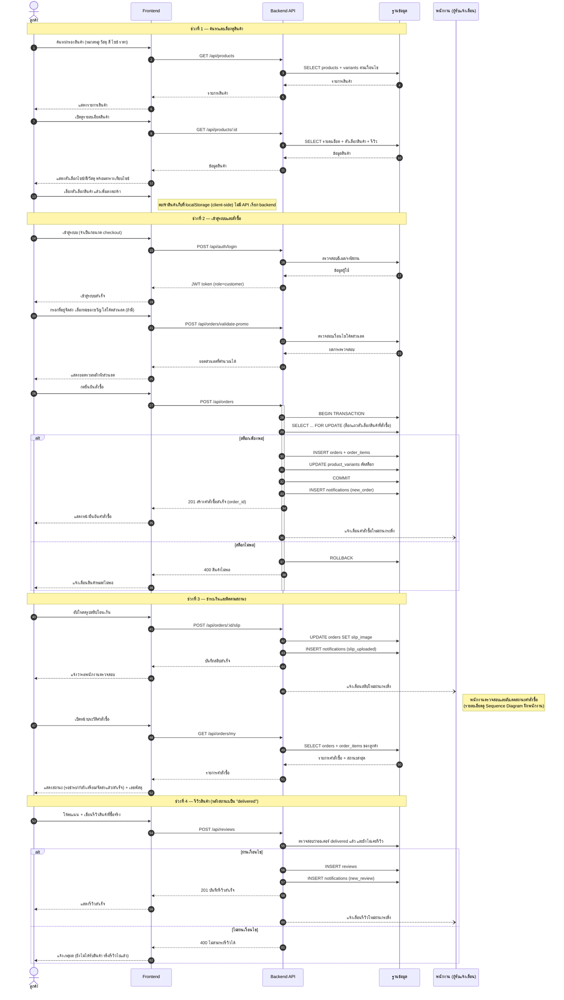

---

## 3.2. Sequence Diagram — พนักงาน (Staff)

ครอบคลุมงานประจำวันของพนักงาน: ตรวจสอบและยืนยันคำสั่งซื้อ จัดส่งสินค้า จัดการสต็อก สินค้า และโปรโมชัน

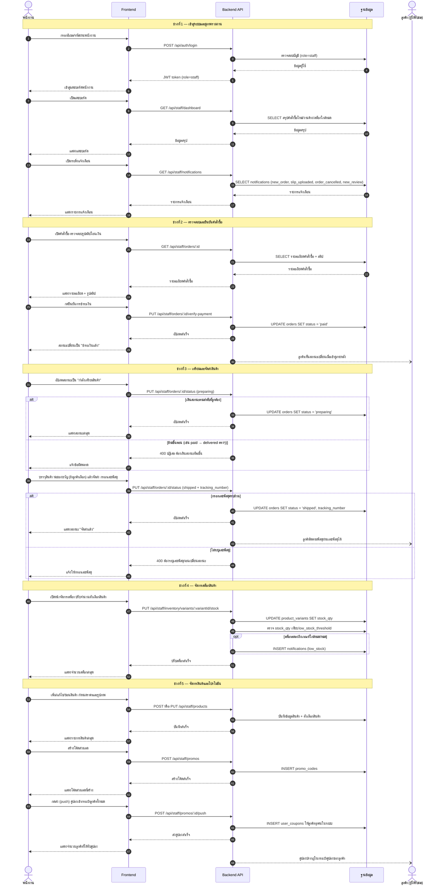

---

## 3.3. Sequence Diagram — แอดมิน (Admin)

ครอบคลุมการเข้าสู่ระบบ (รวมกรณีลืมรหัสผ่านด้วย OTP อีเมลจริง) การดูแดชบอร์ดภาพรวม และการดู/ส่งออกรายงานทั้ง 3 ประเภท

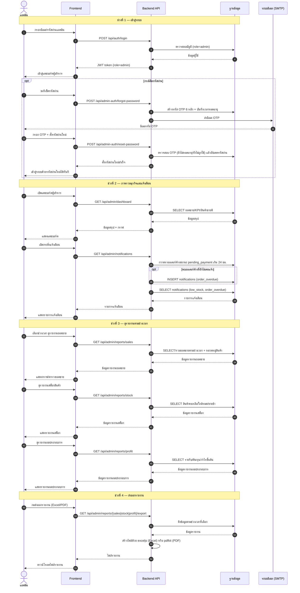

---

## **13.4 Use Case Diagram**


# **14\. โครงสร้างฐานข้อมูล (Database Schema)**

ฐานข้อมูล MySQL ชื่อ `wibwab_db` — โครงสร้างตาราง (`schema.json`):

```json
{
  "database": "wibwab",
  "description": "E-commerce platform database schema (Wibwab)",
  "generated_from": "wibwab_db.pdf",
  "tables": {
    "users": {
      "columns": [
        { "name": "id", "type": "int", "nullable": false, "extra": "auto_increment", "primary_key": true },
        { "name": "email", "type": "varchar(255)", "nullable": false },
        { "name": "password_hash", "type": "varchar(255)", "nullable": false },
        { "name": "full_name", "type": "varchar(150)", "nullable": false },
        { "name": "phone", "type": "varchar(20)", "nullable": true, "default": null },
        { "name": "role", "type": "enum", "enum_values": ["customer", "staff", "admin"], "nullable": false, "default": "customer" },
        { "name": "created_at", "type": "timestamp", "nullable": false, "default": "CURRENT_TIMESTAMP" },
        { "name": "updated_at", "type": "timestamp", "nullable": false, "default": "CURRENT_TIMESTAMP", "extra": "on update CURRENT_TIMESTAMP" }
      ],
      "foreign_keys": []
    },
    "addresses": {
      "columns": [
        { "name": "id", "type": "int", "nullable": false, "extra": "auto_increment", "primary_key": true },
        { "name": "user_id", "type": "int", "nullable": false },
        { "name": "recipient_name", "type": "varchar(150)", "nullable": false },
        { "name": "phone", "type": "varchar(20)", "nullable": false },
        { "name": "address_line", "type": "varchar(255)", "nullable": false },
        { "name": "subdistrict", "type": "varchar(100)", "nullable": false },
        { "name": "district", "type": "varchar(100)", "nullable": false },
        { "name": "province", "type": "varchar(100)", "nullable": false },
        { "name": "postal_code", "type": "varchar(10)", "nullable": false },
        { "name": "is_default", "type": "tinyint(1)", "nullable": false, "default": 0 },
        { "name": "created_at", "type": "timestamp", "nullable": false, "default": "CURRENT_TIMESTAMP" }
      ],
      "foreign_keys": [
        { "column": "user_id", "references_table": "users", "references_column": "id", "on_update": "RESTRICT", "on_delete": "CASCADE" }
      ]
    },
    "categories": {
      "columns": [
        { "name": "id", "type": "int", "nullable": false, "extra": "auto_increment", "primary_key": true },
        { "name": "name", "type": "varchar(100)", "nullable": false },
        { "name": "description", "type": "varchar(255)", "nullable": true, "default": null }
      ],
      "foreign_keys": []
    },
    "products": {
      "columns": [
        { "name": "id", "type": "int", "nullable": false, "extra": "auto_increment", "primary_key": true },
        { "name": "category_id", "type": "int", "nullable": false },
        { "name": "name", "type": "varchar(200)", "nullable": false },
        { "name": "description", "type": "text", "nullable": true, "default": null },
        { "name": "is_visible", "type": "tinyint(1)", "nullable": false, "default": 1 },
        { "name": "created_at", "type": "timestamp", "nullable": false, "default": "CURRENT_TIMESTAMP" },
        { "name": "updated_at", "type": "timestamp", "nullable": false, "default": "CURRENT_TIMESTAMP", "extra": "on update CURRENT_TIMESTAMP" }
      ],
      "foreign_keys": [
        { "column": "category_id", "references_table": "categories", "references_column": "id", "on_update": "RESTRICT", "on_delete": "RESTRICT" }
      ]
    },
    "product_images": {
      "columns": [
        { "name": "id", "type": "int", "nullable": false, "extra": "auto_increment", "primary_key": true },
        { "name": "product_id", "type": "int", "nullable": false },
        { "name": "image_path", "type": "varchar(255)", "nullable": false },
        { "name": "is_primary", "type": "tinyint(1)", "nullable": false, "default": 0 },
        { "name": "sort_order", "type": "int", "nullable": false, "default": 0 }
      ],
      "foreign_keys": [
        { "column": "product_id", "references_table": "products", "references_column": "id", "on_update": "RESTRICT", "on_delete": "CASCADE" }
      ]
    },
    "product_variants": {
      "columns": [
        { "name": "id", "type": "int", "nullable": false, "extra": "auto_increment", "primary_key": true },
        { "name": "product_id", "type": "int", "nullable": false },
        { "name": "sku", "type": "varchar(50)", "nullable": false },
        { "name": "size", "type": "varchar(50)", "nullable": true, "default": null },
        { "name": "color", "type": "varchar(50)", "nullable": true, "default": null },
        { "name": "material", "type": "varchar(100)", "nullable": true, "default": null },
        { "name": "price", "type": "decimal(10,2)", "nullable": false },
        { "name": "cost_price", "type": "decimal(10,2)", "nullable": false, "default": 0.00 },
        { "name": "stock_qty", "type": "int", "nullable": false, "default": 0 },
        { "name": "low_stock_threshold", "type": "int", "nullable": false, "default": 5 },
        { "name": "is_active", "type": "tinyint(1)", "nullable": false, "default": 1 }
      ],
      "foreign_keys": [
        { "column": "product_id", "references_table": "products", "references_column": "id", "on_update": "RESTRICT", "on_delete": "CASCADE" }
      ]
    },
    "favorites": {
      "columns": [
        { "name": "id", "type": "int", "nullable": false, "extra": "auto_increment", "primary_key": true },
        { "name": "user_id", "type": "int", "nullable": false },
        { "name": "product_id", "type": "int", "nullable": false },
        { "name": "created_at", "type": "timestamp", "nullable": false, "default": "CURRENT_TIMESTAMP" }
      ],
      "foreign_keys": [
        { "column": "user_id", "references_table": "users", "references_column": "id", "on_update": "RESTRICT", "on_delete": "CASCADE" },
        { "column": "product_id", "references_table": "products", "references_column": "id", "on_update": "RESTRICT", "on_delete": "CASCADE" }
      ]
    },
    "promo_codes": {
      "columns": [
        { "name": "id", "type": "int", "nullable": false, "extra": "auto_increment", "primary_key": true },
        { "name": "code", "type": "varchar(50)", "nullable": false },
        { "name": "discount_type", "type": "enum", "enum_values": ["percent", "fixed"], "nullable": false },
        { "name": "discount_value", "type": "decimal(10,2)", "nullable": false },
        { "name": "min_order_total", "type": "decimal(10,2)", "nullable": false, "default": 0.00 },
        { "name": "expires_at", "type": "datetime", "nullable": true, "default": null },
        { "name": "usage_limit", "type": "int", "nullable": true, "default": null },
        { "name": "used_count", "type": "int", "nullable": false, "default": 0 },
        { "name": "is_active", "type": "tinyint(1)", "nullable": false, "default": 1 },
        { "name": "push_trigger", "type": "enum", "enum_values": ["manual", "on_register"], "nullable": false, "default": "manual" },
        { "name": "label", "type": "varchar(150)", "nullable": true, "default": null }
      ],
      "foreign_keys": []
    },
    "orders": {
      "columns": [
        { "name": "id", "type": "int", "nullable": false, "extra": "auto_increment", "primary_key": true },
        { "name": "user_id", "type": "int", "nullable": false },
        { "name": "status", "type": "enum", "enum_values": ["pending_payment", "paid", "preparing", "shipped", "delivered", "cancelled"], "nullable": false, "default": "pending_payment" },
        { "name": "shipping_name", "type": "varchar(150)", "nullable": false },
        { "name": "shipping_phone", "type": "varchar(20)", "nullable": false },
        { "name": "shipping_address", "type": "text", "nullable": false },
        { "name": "shipping_postal_code", "type": "varchar(10)", "nullable": false },
        { "name": "subtotal", "type": "decimal(10,2)", "nullable": false },
        { "name": "discount_amount", "type": "decimal(10,2)", "nullable": false, "default": 0.00 },
        { "name": "promo_code_id", "type": "int", "nullable": true, "default": null },
        { "name": "gift_wrap", "type": "tinyint(1)", "nullable": false, "default": 0 },
        { "name": "gift_message", "type": "text", "nullable": true, "default": null },
        { "name": "total_amount", "type": "decimal(10,2)", "nullable": false },
        { "name": "slip_image", "type": "varchar(255)", "nullable": true, "default": null },
        { "name": "tracking_number", "type": "varchar(100)", "nullable": true, "default": null },
        { "name": "paid_at", "type": "datetime", "nullable": true, "default": null },
        { "name": "created_at", "type": "timestamp", "nullable": false, "default": "CURRENT_TIMESTAMP" },
        { "name": "updated_at", "type": "timestamp", "nullable": false, "default": "CURRENT_TIMESTAMP", "extra": "on update CURRENT_TIMESTAMP" }
      ],
      "foreign_keys": [
        { "column": "user_id", "references_table": "users", "references_column": "id", "on_update": "RESTRICT", "on_delete": "RESTRICT" },
        { "column": "promo_code_id", "references_table": "promo_codes", "references_column": "id", "on_update": "RESTRICT", "on_delete": "SET_NULL" }
      ]
    },
    "order_items": {
      "columns": [
        { "name": "id", "type": "int", "nullable": false, "extra": "auto_increment", "primary_key": true },
        { "name": "order_id", "type": "int", "nullable": false },
        { "name": "variant_id", "type": "int", "nullable": false },
        { "name": "quantity", "type": "int", "nullable": false },
        { "name": "unit_price", "type": "decimal(10,2)", "nullable": false },
        { "name": "unit_cost", "type": "decimal(10,2)", "nullable": false, "default": 0.00 }
      ],
      "foreign_keys": [
        { "column": "order_id", "references_table": "orders", "references_column": "id", "on_update": "RESTRICT", "on_delete": "CASCADE" },
        { "column": "variant_id", "references_table": "product_variants", "references_column": "id", "on_update": "RESTRICT", "on_delete": "RESTRICT" }
      ]
    },
    "user_coupons": {
      "columns": [
        { "name": "id", "type": "int", "nullable": false, "extra": "auto_increment", "primary_key": true },
        { "name": "user_id", "type": "int", "nullable": false },
        { "name": "promo_code_id", "type": "int", "nullable": false },
        { "name": "is_used", "type": "tinyint(1)", "nullable": false, "default": 0 },
        { "name": "used_order_id", "type": "int", "nullable": true, "default": null },
        { "name": "assigned_at", "type": "timestamp", "nullable": false, "default": "CURRENT_TIMESTAMP" },
        { "name": "used_at", "type": "datetime", "nullable": true, "default": null }
      ],
      "foreign_keys": [
        { "column": "user_id", "references_table": "users", "references_column": "id", "on_update": "RESTRICT", "on_delete": "CASCADE" },
        { "column": "promo_code_id", "references_table": "promo_codes", "references_column": "id", "on_update": "RESTRICT", "on_delete": "CASCADE" },
        { "column": "used_order_id", "references_table": "orders", "references_column": "id", "on_update": "RESTRICT", "on_delete": "SET_NULL" }
      ]
    },
    "reviews": {
      "columns": [
        { "name": "id", "type": "int", "nullable": false, "extra": "auto_increment", "primary_key": true },
        { "name": "user_id", "type": "int", "nullable": false },
        { "name": "product_id", "type": "int", "nullable": false },
        { "name": "order_id", "type": "int", "nullable": false },
        { "name": "rating", "type": "tinyint", "nullable": false },
        { "name": "comment", "type": "text", "nullable": true, "default": null },
        { "name": "created_at", "type": "timestamp", "nullable": false, "default": "CURRENT_TIMESTAMP" }
      ],
      "foreign_keys": [
        { "column": "user_id", "references_table": "users", "references_column": "id", "on_update": "RESTRICT", "on_delete": "CASCADE" },
        { "column": "product_id", "references_table": "products", "references_column": "id", "on_update": "RESTRICT", "on_delete": "CASCADE" },
        { "column": "order_id", "references_table": "orders", "references_column": "id", "on_update": "RESTRICT", "on_delete": "CASCADE" }
      ]
    },
    "notifications": {
      "columns": [
        { "name": "id", "type": "int", "nullable": false, "extra": "auto_increment", "primary_key": true },
        { "name": "type", "type": "enum", "enum_values": ["new_order", "slip_uploaded", "order_cancelled", "new_review", "low_stock", "order_overdue"], "nullable": false },
        { "name": "message", "type": "varchar(255)", "nullable": false },
        { "name": "order_id", "type": "int", "nullable": true, "default": null },
        { "name": "variant_id", "type": "int", "nullable": true, "default": null },
        { "name": "product_id", "type": "int", "nullable": true, "default": null },
        { "name": "review_id", "type": "int", "nullable": true, "default": null },
        { "name": "is_read", "type": "tinyint(1)", "nullable": false, "default": 0 },
        { "name": "created_at", "type": "timestamp", "nullable": false, "default": "CURRENT_TIMESTAMP" }
      ],
      "foreign_keys": [
        { "column": "order_id", "references_table": "orders", "references_column": "id", "on_update": "RESTRICT", "on_delete": "CASCADE" },
        { "column": "variant_id", "references_table": "product_variants", "references_column": "id", "on_update": "RESTRICT", "on_delete": "CASCADE" },
        { "column": "product_id", "references_table": "products", "references_column": "id", "on_update": "RESTRICT", "on_delete": "CASCADE" },
        { "column": "review_id", "references_table": "reviews", "references_column": "id", "on_update": "RESTRICT", "on_delete": "CASCADE" }
      ]
    },
    "password_resets": {
      "columns": [
        { "name": "id", "type": "int", "nullable": false, "extra": "auto_increment", "primary_key": true },
        { "name": "token", "type": "varchar(255)", "nullable": false },
        { "name": "user_id", "type": "int", "nullable": false },
        { "name": "expires_at", "type": "datetime", "nullable": false },
        { "name": "used", "type": "tinyint(1)", "nullable": false, "default": 0 },
        { "name": "created_at", "type": "timestamp", "nullable": false, "default": "CURRENT_TIMESTAMP" }
      ],
      "foreign_keys": [
        { "column": "user_id", "references_table": "users", "references_column": "id", "on_update": "RESTRICT", "on_delete": "CASCADE" }
      ]
    },
    "password_reset_otps": {
      "columns": [
        { "name": "id", "type": "int", "nullable": false, "extra": "auto_increment", "primary_key": true },
        { "name": "user_id", "type": "int", "nullable": false },
        { "name": "otp_code", "type": "varchar(6)", "nullable": false },
        { "name": "expires_at", "type": "datetime", "nullable": false },
        { "name": "used", "type": "tinyint(1)", "nullable": false, "default": 0 },
        { "name": "created_at", "type": "timestamp", "nullable": false, "default": "CURRENT_TIMESTAMP" }
      ],
      "foreign_keys": [
        { "column": "user_id", "references_table": "users", "references_column": "id", "on_update": "RESTRICT", "on_delete": "CASCADE" }
      ]
    }
  },
  "relationships": [
    { "from_table": "addresses", "from_column": "user_id", "to_table": "users", "to_column": "id", "type": "many_to_one" },
    { "from_table": "favorites", "from_column": "user_id", "to_table": "users", "to_column": "id", "type": "many_to_one" },
    { "from_table": "favorites", "from_column": "product_id", "to_table": "products", "to_column": "id", "type": "many_to_one" },
    { "from_table": "orders", "from_column": "user_id", "to_table": "users", "to_column": "id", "type": "many_to_one" },
    { "from_table": "orders", "from_column": "promo_code_id", "to_table": "promo_codes", "to_column": "id", "type": "many_to_one" },
    { "from_table": "order_items", "from_column": "order_id", "to_table": "orders", "to_column": "id", "type": "many_to_one" },
    { "from_table": "order_items", "from_column": "variant_id", "to_table": "product_variants", "to_column": "id", "type": "many_to_one" },
    { "from_table": "password_resets", "from_column": "user_id", "to_table": "users", "to_column": "id", "type": "many_to_one" },
    { "from_table": "password_reset_otps", "from_column": "user_id", "to_table": "users", "to_column": "id", "type": "many_to_one" },
    { "from_table": "products", "from_column": "category_id", "to_table": "categories", "to_column": "id", "type": "many_to_one" },
    { "from_table": "product_images", "from_column": "product_id", "to_table": "products", "to_column": "id", "type": "many_to_one" },
    { "from_table": "product_variants", "from_column": "product_id", "to_table": "products", "to_column": "id", "type": "many_to_one" },
    { "from_table": "reviews", "from_column": "user_id", "to_table": "users", "to_column": "id", "type": "many_to_one" },
    { "from_table": "reviews", "from_column": "product_id", "to_table": "products", "to_column": "id", "type": "many_to_one" },
    { "from_table": "reviews", "from_column": "order_id", "to_table": "orders", "to_column": "id", "type": "many_to_one" },
    { "from_table": "user_coupons", "from_column": "user_id", "to_table": "users", "to_column": "id", "type": "many_to_one" },
    { "from_table": "user_coupons", "from_column": "promo_code_id", "to_table": "promo_codes", "to_column": "id", "type": "many_to_one" },
    { "from_table": "user_coupons", "from_column": "used_order_id", "to_table": "orders", "to_column": "id", "type": "many_to_one" },
    { "from_table": "notifications", "from_column": "order_id", "to_table": "orders", "to_column": "id", "type": "many_to_one" },
    { "from_table": "notifications", "from_column": "variant_id", "to_table": "product_variants", "to_column": "id", "type": "many_to_one" },
    { "from_table": "notifications", "from_column": "product_id", "to_table": "products", "to_column": "id", "type": "many_to_one" },
    { "from_table": "notifications", "from_column": "review_id", "to_table": "reviews", "to_column": "id", "type": "many_to_one" }
  ]
}
```

# **15\. งานออกแบบ Wireframe และ UI (ทั้ง 3 ส่วน)**

ตามที่ระบุไว้ในข้อ 12 (สิ่งที่ต้องส่งมอบ) — งานออกแบบ Wireframe และ UI ของระบบครบทั้ง 3 บทบาทผู้ใช้งาน
https://www.figma.com/design/IA7juX8Hqbx1VnFx0TBDHk/%E0%B9%82%E0%B8%9B%E0%B8%A3%E0%B9%80%E0%B8%88%E0%B8%84?node-id=0-1&t=7W1MlIc182RiEt2u-1

## **15.1 ส่วนของลูกค้า (Customer)**


## **15.2 ส่วนของพนักงาน (Staff)**


## **15.3 ส่วนของแอดมิน (Admin)**


# **16\. ผลตรวจสอบทางเทคนิค (UAT Test Case)**

| รหัสทดสอบ | วิธีตรวจ | ผลตรวจสอบทางเทคนิค | รายละเอียด |
| ----- | ----- | :---: | ----- |
| **Persona: Customer** |  |  |  |
| **UAT-C01** | ยิง POST /api/auth/register จริง | **✓** | สมัครสำเร็จ 201, สมัครซ้ำอีเมลเดิมถูกปฏิเสธ 400 |
| **UAT-C01b** | ยิง POST /api/auth/register ด้วยอีเมลผิดรูปแบบ | **✓** | ปฏิเสธ 400 "รูปแบบอีเมลไม่ถูกต้อง" |
| **UAT-C02** | ยิง POST /api/auth/login | **✓** | รหัสถูกต้อง 200 + token, รหัสผิด 401 |
| **UAT-C03** | ยิง forgot-password → reset-password → login | **✓** | ตั้งรหัสใหม่ได้, รหัสเดิมใช้ไม่ได้, token เดิมใช้ซ้ำถูกปฏิเสธ 400 |
| **UAT-C04** | ยิง GET /api/products พร้อม keyword/category/price | **✓** | ค้นหา "แหวน" ได้ 2 รายการตรงชื่อ, คำที่ไม่มีสินค้าได้ผลว่าง, กรองรวมกันทำงานถูกต้อง |
| **UAT-C05** | ทดสอบด้วยตนเองผ่านเบราว์เซอร์ (Manual — เลือก variant และเพิ่มลงตะกร้าจริงใน ProductDetailPage/CartPage) | **✓** | เลือกไซซ์/สีผ่าน VariantSelector แล้วเพิ่มลงตะกร้าได้ถูกต้อง ราคารวมตรงตาม variant ที่เลือก, ปุ่ม "เพิ่มลงตะกร้า" ถูก disabled เมื่อยังไม่เลือก variant, variant ที่ stock_qty=0 เพิ่มลงตะกร้าไม่ได้, ปรับจำนวนเกินสต็อกถูก clamp ไม่ให้เกิน stock_qty จริง |
| **UAT-C06** | สร้างออเดอร์จริง + แนบสลิปจริง | **✓** | สร้างออเดอร์สำเร็จ 201, แนบสลิปสำเร็จ, สต็อกถูกตัดถูกต้อง |
| **UAT-C06b** | ยิง POST /api/orders พร้อมกัน 2 request ด้วย payload เดียวกัน | **✗** | ทั้ง 2 request สร้างออเดอร์สำเร็จพร้อมกัน (order_id ต่างกัน) — ระบบไม่มีกลไกกันคำขอซ้ำระดับ API เลย มีแค่ปุ่ม frontend disabled={isSubmitting} ที่ CheckoutPage.jsx กันคลิกซ้ำได้ระดับ UI เท่านั้น หากมี 2 request เข้าพร้อมกันจริง (เน็ตกระตุก/retry) จะได้ออเดอร์ซ้ำ |
| **UAT-C06c** | ยิงสั่งซื้อ variant ที่ stock_qty = 0 | **✓** | ปฏิเสธ 400 "มีไม่พอ (เหลือ 0 ชิ้น)" ไม่สร้างออเดอร์ |
| **UAT-C06d** | เทียบ subtotal/total_amount จาก response กับคำนวณเอง | **✓** | สั่งซื้อ 490×1 + 250×2 = 990 ตรงกับที่ระบบบันทึกทุกบาท |
| **UAT-C07** | รีวิวสินค้าหลังเดินสถานะออเดอร์จนถึง delivered | **✓** | รีวิวออเดอร์ delivered สำเร็จ, รีวิวซ้ำถูกปฏิเสธ ("คุณรีวิวสินค้านี้ไปแล้ว"), รีวิวออเดอร์ที่ยังไม่ delivered ถูกปฏิเสธ |
| **Persona: Staff** |  |  |  |
| **UAT-S01** | ยิง PUT /api/staff/orders/:id/verify-payment | **✓** | เปลี่ยนสถานะ pending_payment → paid สำเร็จ |
| **UAT-S02** | ยิง PUT .../status ทีละขั้น + ข้ามขั้นโดยตั้งใจ | **✓** | ข้ามขั้น (paid→delivered ตรงๆ) ถูกปฏิเสธ 400, ไม่กรอกเลขพัสดุตอนเปลี่ยน shipped ถูกปฏิเสธ, เดินสถานะปกติครบ + เลขพัสดุถูกบันทึกจริงในฐานข้อมูล |
| **UAT-S03** | ยิง PUT .../inventory/variants/:id/stock ปรับสต็อกต่ำกว่า threshold | **✓** | ปรับสต็อก variant เดียวสำเร็จไม่กระทบตัวอื่น, ระบบสร้างแจ้งเตือน low_stock จริงในฐานข้อมูล (ยืนยันด้วย query ตรง) |
| **UAT-S03b** | ยิง POST /api/orders พร้อมกัน 5 request แย่งสต็อกที่เหลือ 2 ชิ้น (คนละบัญชี) | **✓** | สำเร็จเป๊ะ 2 request ที่เหลือถูกปฏิเสธ "มีไม่พอ" สต็อกสุดท้าย = 0 ไม่ติดลบ (แสดงว่า row locking (FOR UPDATE) ทำงานถูกต้อง) |
| **UAT-S04** | ยิง POST/PUT /api/staff/products สร้าง-แก้ไข-ซ่อนสินค้า | **✓** | สินค้าใหม่ที่ is_visible=true โผล่หน้าร้านทันที, แก้ไข+ซ่อน (is_visible=false) แล้วหายจากหน้าร้านทันที |
| **Persona: Admin** |  |  |  |
| **UAT-A01** | ยิง GET /api/admin/dashboard ด้วย token admin/staff/customer/ไม่มี token | **✓** | admin เข้าได้ 200, staff/customer ถูกปฏิเสธ 403, ไม่มี token ถูกปฏิเสธ 401 |
| **UAT-A02** | ยิง GET /api/admin/dashboard | **✓** | ระบบคำนวณ KPI/กราฟยอดขาย/top products ออกมาได้ถูกต้อง |
| **UAT-A03** | ยิง GET /api/admin/reports/sales + export | **✓** | ดูตามช่วงเวลาได้, export Excel สำเร็จ (content-type ถูกต้อง) |
| **UAT-A04** | ยิง GET /api/admin/reports/stock | **✓** | พบสินค้าใกล้หมด 4 รายการ ตรงกับฐานข้อมูล |
| **UAT-A05** | ยิง GET /api/admin/reports/profit | **✓** | เรียกดูรายงานกำไรสำเร็จ |

**สรุปผลการตรวจสอบ**

| 21 / 21 เคส ตรวจสอบครบทั้งหมด | 20 เคส ผ่านจริง | 1 เคส พบบั๊ก |
| ----- | :---: | :---: |

# **17\. เอกสาร SLA (Service Level Agreement)**


# **18\. System Architecture**

## 1. ภาพรวมระบบ — 3-tier + 3 พอร์ทัลอิสระ

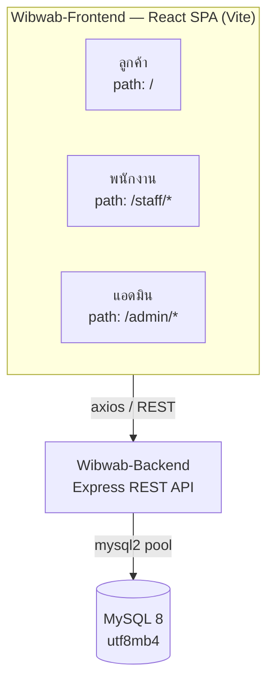

---

## 2. สถาปัตยกรรม Backend

### 2.1 Layering

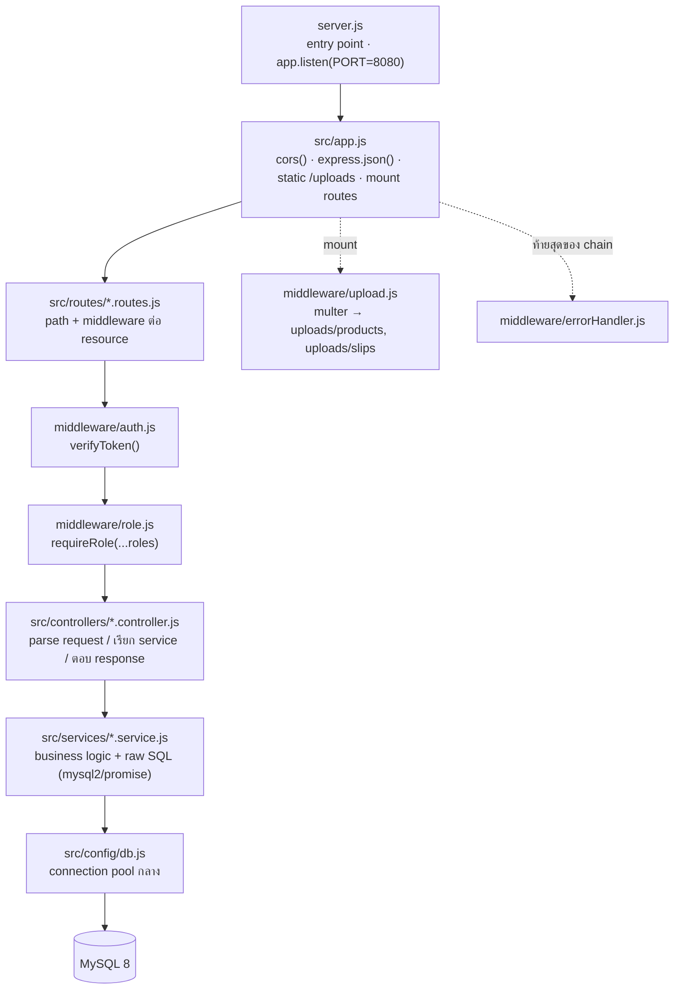

### 2.2 Route groups

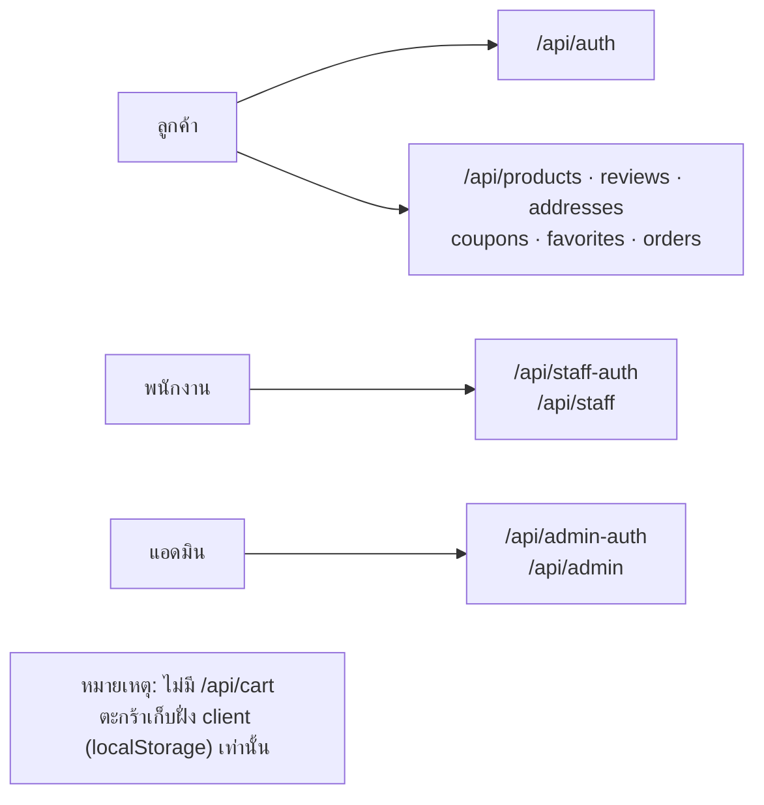

---

## 3. สถาปัตยกรรม Frontend

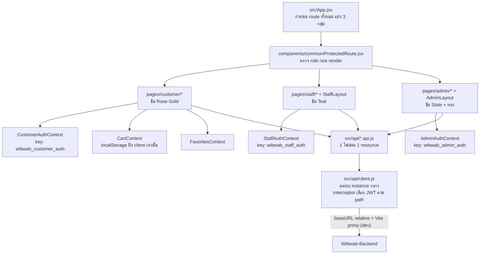

---

## 4. การยืนยันตัวตนและสิทธิ์ (Auth & RBAC)

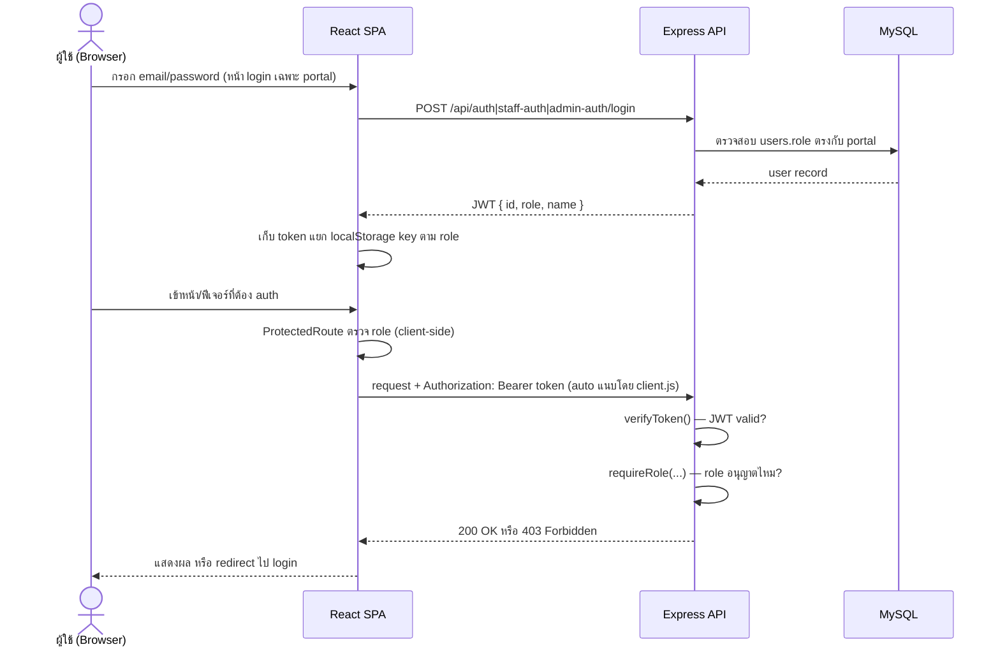

---

## 5. ฐานข้อมูล — กลุ่มตารางตามความรับผิดชอบ

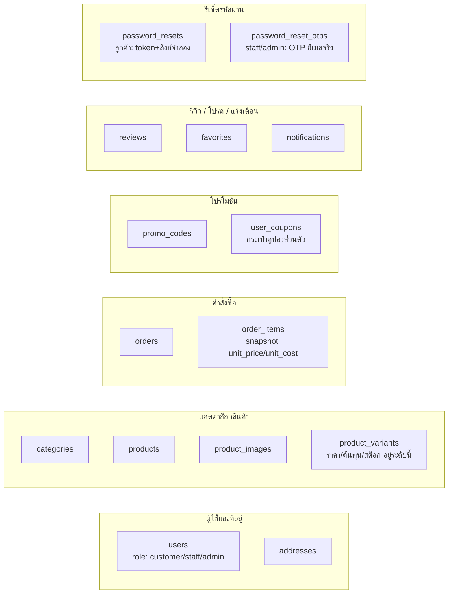

---

## 6. Business flow หลัก — วงจรคำสั่งซื้อ (Order Lifecycle)

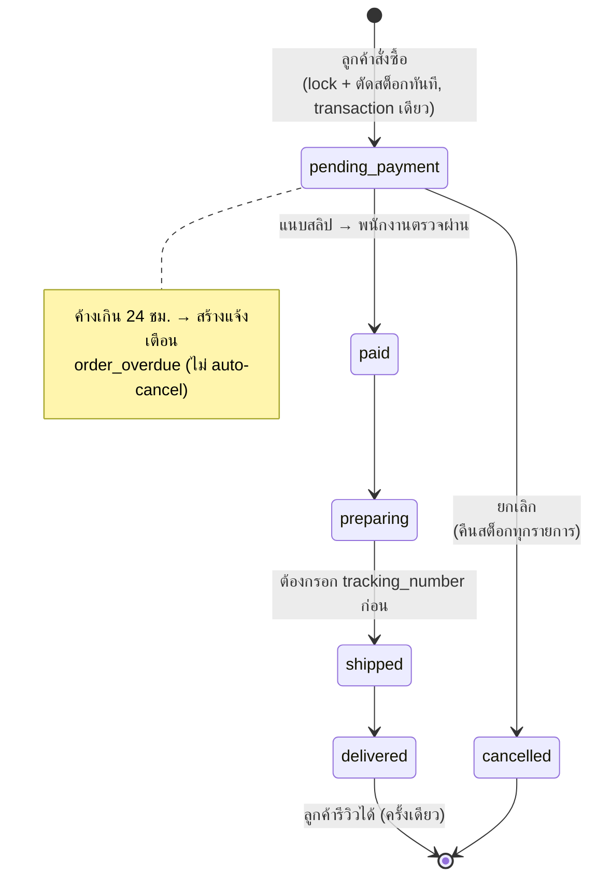

---

## 7. ระบบแจ้งเตือน (Notification)

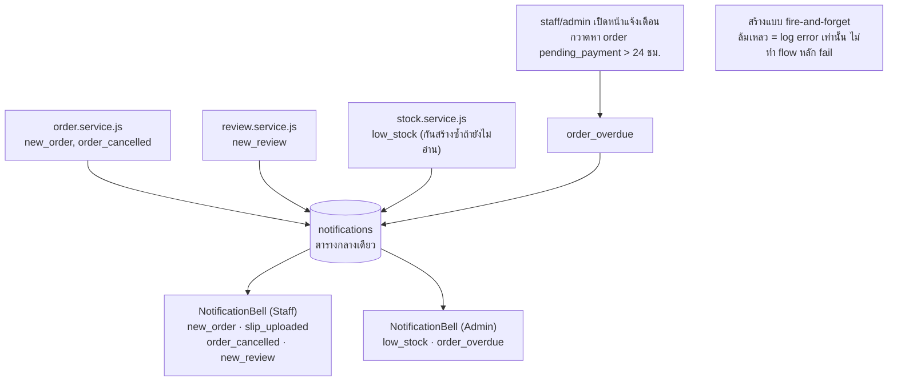

---

## 9. Dev Environment

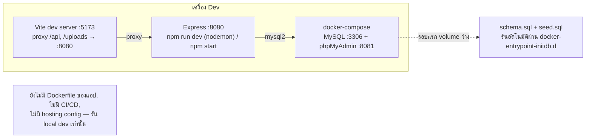

#  **19\. personaa design**

---

## 1. คุณสายฝน ใจดี — ลูกค้า (Customer)

| | |
|---|---|
| **อายุ** | 27 ปี |
| **อาชีพ** | พนักงานออฟฟิศ |
| **ความถนัดเทคโนโลยี** | สูง (85%) |
| **ความถี่การใช้งาน** | ปานกลาง-สูง (70%) |

> *"ขอแค่สั่งง่าย จ่ายไว แล้วรู้สถานะของตลอดเวลา"*

**เป้าหมาย (Goals)**
- หาสินค้าที่ถูกใจได้เร็วและง่าย
- มั่นใจเรื่องการชำระเงินและการจัดส่ง
- ได้ใช้คูปอง/ส่วนลดอย่างคุ้มค่า

**ปัญหาที่เจอ (Pain Points)**
- กลัวโอนเงินแล้วไม่ได้รับของจริง
- ไม่รู้สถานะออเดอร์ระหว่างรอสินค้า
- ขั้นตอนสั่งซื้อยุ่งยากเกินไปบนมือถือ

**พฤติกรรม**
- ช้อปผ่านมือถือช่วงเย็น–ก่อนนอน
- อ่านรีวิวก่อนตัดสินใจซื้อทุกครั้ง

**ฟีเจอร์ที่ใช้บ่อย**
`ค้นหา/กรองสินค้า` · `ตะกร้า` · `แนบสลิป` · `ติดตามสถานะ` · `รีวิว`

---

## 2. คุณเอกชัย มั่นคง — พนักงาน (Staff)

| | |
|---|---|
| **อายุ** | 24 ปี |
| **อาชีพ** | พนักงานหลังบ้านร้าน |
| **ความถนัดเทคโนโลยี** | ปานกลาง (60%) |
| **ความถี่การใช้งาน** | สูงมาก (95%) |

> *"ต้องตรวจงานให้ไวและไม่พลาด ลูกค้ารอไม่ได้"*

**เป้าหมาย (Goals)**
- ตรวจสอบสลิป/อัปเดตสถานะได้รวดเร็ว แม่นยำ
- จัดการสต็อกไม่ให้สินค้าขาดหรือเกิน
- ลดขั้นตอนงานที่ต้องทำซ้ำซ้อน

**ปัญหาที่เจอ (Pain Points)**
- ออเดอร์เข้าพร้อมกันจำนวนมากช่วงพีค
- ต้องสลับไปมาหลายหน้าจอในการทำงาน

**พฤติกรรม**
- ใช้งานผ่านคอมพิวเตอร์หน้าร้านเป็นหลัก
- เปิดดูแจ้งเตือนตลอดช่วงเวลาทำงาน

**ฟีเจอร์ที่ใช้บ่อย**
`แดชบอร์ดพนักงาน` · `อัปเดตสถานะ` · `จัดการสต็อก` · `จัดการโปรโมชัน`

---

## 3. คุณพิมพ์ใจ วิบูลย์ทรัพย์ — แอดมิน (Admin)

| | |
|---|---|
| **อายุ** | 35 ปี |
| **อาชีพ** | เจ้าของ/ผู้บริหารร้าน |
| **ความถนัดเทคโนโลยี** | ปานกลาง-สูง (70%) |
| **ความถี่การใช้งาน** | ปานกลาง (45%) |

> *"อยากเห็นภาพรวมธุรกิจในที่เดียว ตัดสินใจได้ไว"*

**เป้าหมาย (Goals)**
- ติดตามยอดขาย/กำไรแบบภาพรวมได้ไว
- วางแผนสต็อกและโปรโมชันจากข้อมูลจริง
- ดึงรายงานไปนำเสนอทีมบัญชี/นักลงทุน

**ปัญหาที่เจอ (Pain Points)**
- ข้อมูลกระจัดกระจายอยู่หลายที่
- ไม่มีเวลาลงรายละเอียดทีละออเดอร์
- ต้องรอพนักงานสรุปข้อมูลให้ทุกครั้ง

**พฤติกรรม**
- เข้าดูแดชบอร์ดสัปดาห์ละหลายครั้ง
- ตัดสินใจโปรโมชันจากข้อมูลยอดขายจริง

**ฟีเจอร์ที่ใช้บ่อย**
`แดชบอร์ดผู้บริหาร` · `รายงานยอดขาย/สต็อก/กำไร` · `Export Excel/PDF` · `แจ้งเตือนทุกประเภท (low_stock, order_overdue)`


